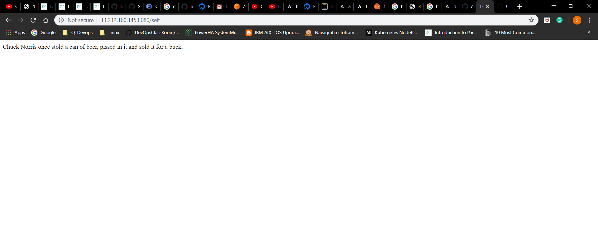

# Python wrapper for Chuck Norris jokes from API https://api.chucknorris.io/

#### Installation:

* Below are the steps required to perform on a base linux system.

   * Installation of Python and its dependencies
   ```
   apt-get install -y python python-setuptools python-dev build-essential python-pip
   ``` 
   * Installation of  Python Flask Library
   ```
      pip install flask
   ```
  * Below is the source code which I clone from GitHub repository (https://github.com/sunildasu1234/pythonFlaskApp.git) 
#### Python code:
```
"""
Python wrapper for Chuck Norris jokes from API https://api.chucknorris.io/

:author:     --  Sunil Kumar <sunildasu1234@gmail.com>
"""
import requests
from flask import Flask

app = Flask(__name__)


class ChuckNorris(object):

    @app.route("/")
    def main():
        return "Welcome! to Chuck-norris"

    @app.route('/jokes')
    def get_jokes():
        url = 'https://api.chucknorris.io/jokes/random'
        response = requests.get(url)
        return response.json()['value']

    if __name__ == "__main__":
        app.run(host="0.0.0.0", port=8080)

```
 * Once we checkout the code, I have executed below commands to run python code,
    
    ```
    python setup.py install
    python setup.py build
    python __init__.py
   
    ```
    
 *  Verified with curl command to get the jokes displayed randomly and also verfied with public IP of the machine from the 
    browser i.e http://<public-ip>:8080. I can able to view the jokes.
```
root@ubuntu:/pythonFlaskApp/chuck# curl http://10.128.0.11:8080/jokes
10.128.0.11 - - [18/Apr/2020 11:00:38] "GET /self HTTP/1.1" 200 -
A strange-but-true phenomenon - whenever there is a natural disaster in the world, Chuck Norris' stocks soar.root@ubuntu:/pythonFlaskApp/chuck# curl http://10.128.0.11:8080/jokes
10.128.0.11 - - [18/Apr/2020 11:00:51] "GET /self HTTP/1.1" 200 -
Chuck Norris says, 'if life gives you lemons, punch it in the nuts until it doesn't.'root@ubuntu:/pythonFlaskApp/chuck# curl http://10.128.0.11:8080/jokes
10.128.0.11 - - [18/Apr/2020 11:00:58] "GET /jokes HTTP/1.1" 200 -
Lindsay Lohan once put a hickey on one of Chuck Norris' hemorrhoids.root@ubuntu:/pythonFlaskApp/chuck# 79.194.192.221 - - [18/Apr/2020 11:01:04] "GET / HTTP/1.1" 200 -
79.194.192.221 - - [18/Apr/2020 11:01:05] "GET /favicon.ico HTTP/1.1" 404 -
79.194.192.221 - - [18/Apr/2020 11:01:14] "GET /jokes HTTP/1.1" 200 -
79.194.192.221 - - [18/Apr/2020 11:01:22] "GET /jokes HTTP/1.1" 200 -

```
* Next I have installed docker manually and create Dockerfile to build the image.

   DockerFile:
    
   ```
   FROM python:3.7-alpine
   LABEL author=Sunil
   ARG HOME_DIR='/pythonFlaskApp'
   ADD . $HOME_DIR
   EXPOSE 8080
   WORKDIR $HOME_DIR
   RUN pip install -r requirements.txt 
   RUN sh build.sh && echo ls -ld $HOME_DIR/chuck/
   ENTRYPOINT ["python", "__init__.py"]
   ```
* Below are the commands which I used to build the docker image and run the container,
  ```
      docker image build -t chucknorrise:1.0 .
      docker image ls
      docker run -d --name myapp -p 8080:8080 chucknorrise:1.0
  ```
* Once container is up and running, I checked in the browser using public IP (http://public-ip:8080/jokes) then I can 
   able view the chuck norris jokes messages randomly after every refresh.
   
  
   
 ```
 ansible@ip-172-31-38-224:~$ docker image ls
REPOSITORY          TAG                 IMAGE ID            CREATED             SIZE
chucknorris_jokes   1.0                 81affaa1e6fa        9 minutes ago       110MB
python              3.7-alpine          7fbc871584eb        4 weeks ago         95.8MB
ansible@ip-172-31-38-224:~$ docker ps -a
CONTAINER ID        IMAGE                   COMMAND                CREATED             STATUS              PORTS                    NAMES
534a3e9d4c7a        chucknorris_jokes:1.0   "python __init__.py"   9 minutes ago       Up 9 minutes        0.0.0.0:8080->8080/tcp   chucknorrisapp
ansible@ip-172-31-38-224:~$ curl http://172.31.38.224:8080
Welcome! to Chuck-norrisansible@ip-172-31-38-224:~$ curl http://172.31.38.224:8080/jokes
Chuck Norris can run so fast, he can actually shoot an apple off of his own headansible@ip-172-31-38-224:~$ curl http://172.31.38.224:8080/jokes
ansible@ip-172-31-38-224:~$ curl http://172.31.38.224:8080/jokes
There is no 'ctrl' button on Chuck Norris's computer. Chuck Norris is always in control.ansible@ip-172-31-38-224:~$


 ```

 # Deploying chucknorris python Application using Ansible 
  
Ansible Terms
  * Playbook: Declarative specification for your application deployment using YAML.
  * Inventory: Node information.(List of nodes)
  * Ansible Control Server: The machine/system on which ansible is installed
  * Managed Node or Node: The machine/system which has python installed and which we want to control from Ansible.
  
Installation
  * Created two t2.micro with ubuntu 18.04 image
  * Login into ansible control server
      
   ```
    * Used below cmds to install ansible in control machine
        sudo apt update
        sudo apt install software-properties-common
        sudo apt-add-repository --yes --update ppa:ansible/ansible
        sudo apt install ansible
  
   ```

 * We need to configure the user in ansible control server and node as well.
 
     * Logged into ansible control server and performed below steps
        * Ensure password based authentication is enabled.
        * Create a user called as ansible.
        * Provide sudo privileges to the ansible user.
        * Generate a key for the ansible user.
     * Logged into node and performed below steps
        * Ensure password based authentication is enabled.
        * Create a user called as ansible.
        * Provide sudo privileges to the ansible user.
        * Generate a key for the user.
        
     * Login into ansible control server & copy the public key to node for seamless authentication.
     
   * Playbook:
     * Below are the steps performed to execute ansible playbook.
       1. Used apt module to update the packages.
       2. Install docker and created ansible user and assign to docker group.
       3. Clone the code from git repo (https://github.com/sunildasu1234/pythonFlaskApp.git) and 
          kept in chucknorris directory
       4. Installed python-pip and pip libraries.
       5. To Build the docker image used "docker_image" module.
       6. To run the docker image in a container used "docker_container" module.
       
     ```
        ---
        - hosts: all
          become: true
          vars:
            DOCKER_PACKAGES:
              - apt-transport-https
              - ca-certificates
              - curl
              - gnupg-agent
              - software-properties-common
            USER: "ansible"
            repo: "https://github.com/sunildasu1234/pythonFlaskApp.git"
          tasks: 
          - name: Install packages needed for Docker
            apt:
              name: "{{ DOCKER_PACKAGES }}"
              state: present
              force_apt_get: "yes"
        
          - name: Add Docker GPG apt Key
            apt_key:
              url: https://download.docker.com/linux/ubuntu/gpg
              state: present
        
          - name: Save the current Ubuntu release version into a variable
            shell: lsb_release -cs
            register: ubuntu_version
        
          - name: Add Docker Repository
            apt_repository:
              repo: "deb [arch=amd64] https://download.docker.com/linux/ubuntu {{ ubuntu_version.stdout }} stable"
              state: present
        
          - name: Update apt packages
            apt:
              update_cache: "yes"
              force_apt_get: "yes"
        
          - name: Install Docker
            apt:
              name: "docker-ce"
              state: present
              force_apt_get: "yes"
        
          - name: Create docker group
            group:
              name: "docker"
              state: present
        
          - name: Adding user {{ USER }} to docker group  
            user:
              name: "{{ USER }}"
              groups: "docker"
              append: "yes"
              
          - name: Change file permissions to docker daemon socket
            file:
              path: /var/run/docker.sock
              mode: '0777'
         
          - name: Example checkout a github repo and use refspec to fetch all pull requests
            git:
              repo: "{{ repo }}"
              dest: /chucknorris
              refspec: "+refs/pull/*:refs/heads/*"
        
          - name: Install PIP 
            apt:
              name: python-pip
              state: latest
        
          - name: install pip libraries
            pip: 
              name:
              - flask
              - docker
              - requests>=2.20.1
        
          - name: build the image
            docker_image: 
              name: chucknorris_jokes
              tag: 1.0
              path: /chucknorris
              state: present
        
          - name: run this chucknorris_jokes image in a docker container
            docker_container:
              name: chucknorrisapp
              image: "chucknorris_jokes:1.0"
              state: started
              published_ports:
                - "8080:8080"   
     ```
    
 * Finally I can able to view the Chucknorris jokes from the browser (http://public-ip:8080/jokes)      
        
  
