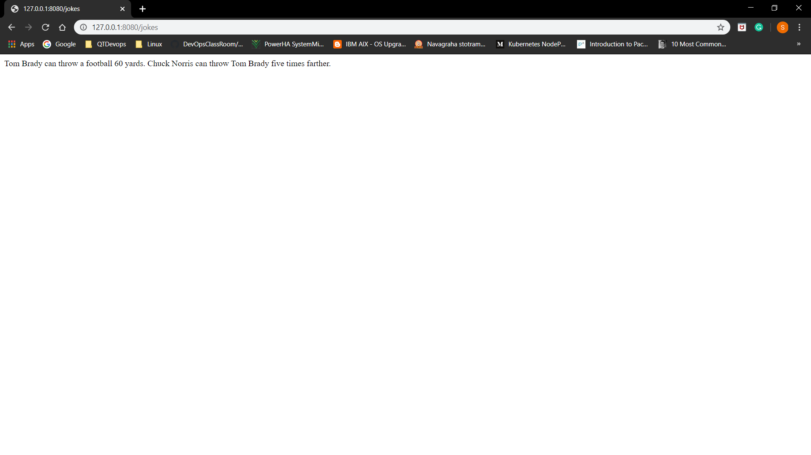

# chuck-norris-pythonPython wrapper for "The Chuck Norris from API https://api.chucknorris.io/ and compatible with python 2 & 3.
Python wrapper for Chuck Norris jokes from API https://api.chucknorris.io/

#### Installation:

* Below are the steps required to get this working on a base linux system.

   * Installed Python and its dependencies
   ```
   apt-get install -y python python-setuptools python-dev build-essential python-pip
   ``` 
   * Installed Python Flask dependency
   ```
      pip install flask
   ```
  * Below is the code which is cloned from central repository (https://github.com/sunildasu1234/pythonFlaskApp.git) 
#### Python code:
```
"""
Python wrapper for Chuck Norris jokes from API https://api.chucknorris.io/

:author:     --  Sunil Kumar <sunildasu1234@gmail.com>
:license:    --  MIT License - http://www.opensource.org/licenses/mit-license.php
"""
import requests
from flask import Flask
app = Flask(__name__)

class NorrisException(Exception):
    pass


class Norris(object):

    def __init__(self):
        self.id = None
        self.joke = None
        self.categories = None

    def __repr__(self):
        return '<{cls}: {joke}>'.format(
            cls=self.__class__.__name__,
            joke=self.joke
        )


class ChuckNorris(object):

    def __init__(self):
        self.base_url = 'http://api.icndb.com/jokes/'

    @app.route('/self')
    def get_jokes_count():
        url = 'https://api.chucknorris.io/jokes/random'
        response = requests.get(url)
        return response.json()['value']

@app.route("/")
def main():
    return "Welcome! to Chuck-norris"

if __name__ == "__main__":
    app.run(host="127.0.0.1", port=8080)
```
* Once the code is cloned, I have executed build.sh script which contains below commands,
    python setup.py install
    python setup.py build
    python __init__.py
    Executed curl for verification, below is the output:
```
root@ubuntu:/pythonFlaskApp/chuck# curl http://10.128.0.11:8080/self
10.128.0.11 - - [18/Apr/2020 11:00:38] "GET /self HTTP/1.1" 200 -
A strange-but-true phenomenon - whenever there is a natural disaster in the world, Chuck Norris' stocks soar.root@ubuntu:/pythonFlaskApp/chuck# curl http://10.128.0.11:8080/self
10.128.0.11 - - [18/Apr/2020 11:00:51] "GET /self HTTP/1.1" 200 -
Chuck Norris says, 'if life gives you lemons, punch it in the nuts until it doesn't.'root@ubuntu:/pythonFlaskApp/chuck# curl http://10.128.0.11:8080/self
10.128.0.11 - - [18/Apr/2020 11:00:58] "GET /self HTTP/1.1" 200 -
Lindsay Lohan once put a hickey on one of Chuck Norris' hemorrhoids.root@ubuntu:/pythonFlaskApp/chuck# 79.194.192.221 - - [18/Apr/2020 11:01:04] "GET / HTTP/1.1" 200 -
79.194.192.221 - - [18/Apr/2020 11:01:05] "GET /favicon.ico HTTP/1.1" 404 -
79.194.192.221 - - [18/Apr/2020 11:01:14] "GET /self HTTP/1.1" 200 -
79.194.192.221 - - [18/Apr/2020 11:01:22] "GET /self HTTP/1.1" 200 -
```
* Next I have installed docker manually and create Dockerfile to build the image.

   DockerFile:
    
   ```
   FROM python:3.7-alpine
   LABEL author=Sunil
   ARG HOME_DIR='/pythonFlaskApp'
   ADD . $HOME_DIR
   EXPOSE 8080
   WORKDIR $HOME_DIR
   RUN pip install -r requirements.txt 
   RUN sh build.sh && echo ls -ld $HOME_DIR/chuck/
   ENTRYPOINT ["python", "__init__.py"]
   ```
* Below commands is used to build the docker image and run the container,
  ```
      docker image build -t chucknorrise:1.0 .
      docker image ls
      docker run -d --name myapp -p 8080:8080 chucknorrise:1.0
  ```
* Once when the container is up and running I have tested in browser using public IP (http://<public-ip>:8080/self) i can 
   able view the chuck norris jokes messages randomly after every refresh.
   
   
   
 ```
root@ubuntu:/pythonFlaskApp# docker container ps -a
CONTAINER ID        IMAGE               COMMAND                CREATED             STATUS              PORTS                    NAMES
179c750bb8f5        chucknorrise:1.0    "python __init__.py"   4 seconds ago       Up 3 seconds        0.0.0.0:8080->8080/tcp   myapp
root@ubuntu:/pythonFlaskApp# curl http://10.128.0.11:8080
Welcome! Hello worldroot@ubuntu:/pythonFlaskApp# curl http://10.128.0.11:8080
Welcome! Hello worldroot@ubuntu:/pythonFlaskApp# curl http://10.128.0.11:8080/self
Chuck Norris can make a virgin go ass-to-mouth on a first date.root@ubuntu:/pythonFlaskApp# curl http://10.128.0.11:8080/self
Remember when I said Chuck Norris was slower than Sonic. I lied. Their top speed is equal.
root@ubuntu:/pythonFlaskApp# 

 ```

****Deploying chucknorris python Application using Ansible****
  
Ansible Terms
  * Playbook: Declarative specification for your application deployment using YAML.
  * Inventory: Node information.(List of nodes)
  * Ansible Control Server: The machine/system on which ansible is installed
  * Managed Node or Node: The machine/system which has python installed and which we want to control from Ansible.
  
Installation
  * Created two t2.micro with ubuntu 18 image
  * Login into ansible control server
      
   ```
    * Used below cmds to install ansible in control machine
        sudo apt update
        sudo apt install software-properties-common
        sudo apt-add-repository --yes --update ppa:ansible/ansible
        sudo apt install ansible
  
   ```

 * We need to configure an admin user on the ansible control server and also nodes
     * Login into ansible control server and
        * Ensure password based authentication is enabled
        * Create a user called as admin
        * Give admin user sudo privileges
        * Now create a key for the user admin
     * Login into node
        * Ensure password based authentication is enabled
        * Create a user called as admin
        * Give admin user sudo privileges
        * Now create a key for the user admin
     * Login into ansible control server
     * Copy the public key to ansible node for seamless authentication
     
   * Playbook:
      * Below are the steps performed to execute ansible playbook.
       1. Used apt module to update the packages.
       2. Install docker and created admin user and assign to docker group.
       3. Clone the pyhton code from central repo (https://github.com/sunildasu1234/pythonFlaskApp.git) and 
          kept in chucknorris directory
       4. Installed python-pip and pip libraries (docker)
       5. To Build the docker image used "docker_image" module in ansible.
       6. To run the docker image in a container used "docker_container" module in ansible
       
     ```
        ---
        - hosts: all
          become: true
          vars:
            DOCKER_PACKAGES:
              - apt-transport-https
              - ca-certificates
              - curl
              - gnupg-agent
              - software-properties-common
            USER: "admin"
          tasks: 
          - name: update packages
            apt:
                update_cache: "yes"
                force_apt_get: "yes"
        
          - name: Install packages needed for Docker
            apt:
              name: "{{ DOCKER_PACKAGES }}"
              state: present
              force_apt_get: "yes"
        
          - name: Add Docker GPG apt Key
            apt_key:
              url: https://download.docker.com/linux/ubuntu/gpg
              state: present
        
          - name: Save the current Ubuntu release version into a variable
            shell: lsb_release -cs
            register: ubuntu_version
        
          - name: Add Docker Repository
            apt_repository:
              repo: "deb [arch=amd64] https://download.docker.com/linux/ubuntu {{ ubuntu_version.stdout }} stable"
              state: present
        
          - name: Update apt packages
            apt:
              update_cache: "yes"
              force_apt_get: "yes"
        
          - name: Install Docker
            apt:
              name: "docker-ce"
              state: present
              force_apt_get: "yes"
        
          - name: Create docker group
            group:
              name: "docker"
              state: present
        
          - name: Adding user {{ USER }} to docker group  
            user:
              name: "{{ USER }}"
              groups: "docker"
              append: "yes"
              
          - name: Change file permissions to docker daemon socket
            file:
              path: /var/run/docker.sock
              mode: '0777'
         
          - name: Example checkout a github repo and use refspec to fetch all pull requests
            git:
              repo: https://github.com/sunildasu1234/pythonFlaskApp.git
              dest: /chucknorris
              refspec: "+refs/pull/*:refs/heads/*"
        
          - name: Install PIP 
            apt:
              name: python-pip
              state: latest
        
          - name: install pip libraries
            pip: 
              name: 
              - docker
              - requests>=2.20.1
        
          - name: build the image
            docker_image: 
              name: chucknorris_jokes
              tag: 1.0
              path: /chucknorris
              state: present
        
          - name: run this chucknorris_jokes image in a docker container
            docker_container:
              name: chucknorrisapp
              image: "chucknorris_jokes:1.0"
              state: started
              published_ports:
                - "8080:8080"
     ```
    
 * Finally I can able to view the chucknorris jokes from the browser (http://<public-ip>:8080/self)      
        
  